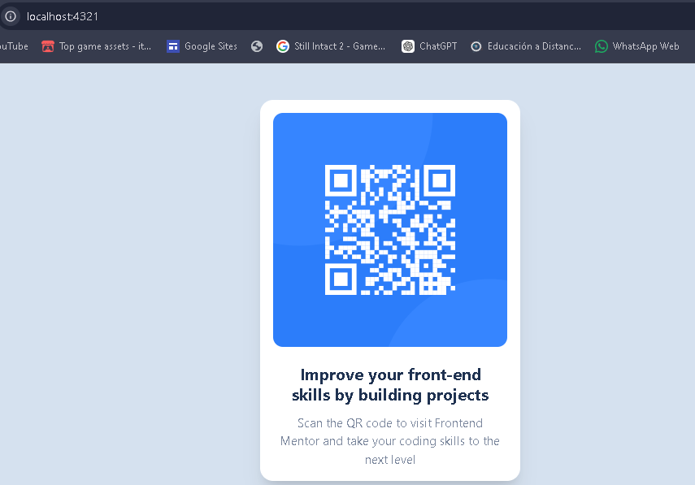

# 🧩 Proyecto: Componente QR Code

Este proyecto consiste en el desarrollo de un **componente de Código QR** utilizando **Astro** y **Tailwind CSS**.  
El objetivo es aplicar los conocimientos sobre **componentes**, **maquetación**, **estilos responsivos** y **utilidades CSS** para construir un diseño limpio, moderno y adaptable a diferentes dispositivos.

---

## 📖 Descripción general

### 🧩 Vista previa del proyecto

El componente presenta un diseño limpio y moderno, optimizado para una visualización clara en diversos dispositivos.


---

### 🔗 Enlaces del proyecto

- **Repositorio en GitHub:** [Agrega aquí la URL de tu repositorio](https://github.com/)
- **Sitio desplegado (opcional):** [Agrega aquí la URL del proyecto desplegado, si usaste Vercel o Netlify](https://)

---

## 🧠 Proceso de desarrollo

### 🛠️ Tecnologías utilizadas
Lista las herramientas y tecnologías que utilize en el proyecto.

- [Astro](https://astro.build)
- [Tailwind CSS](https://tailwindcss.com/)
- Diseño responsivo

---

### 💡 Lo que aprendí
- Crear componentes reutilizables utilizando Astro.
- Aplicar estilos de manera rápida y eficiente con Tailwind CSS.
- Implementar diseño responsivo utilizando utilidades como `flex`, `max-width` y `padding`.
- Organizar mejor la estructura de un proyecto frontend.

Ejemplo:
```html
<div class="bg-white p-4 rounded-2xl shadow-xl max-w-[320px] mx-auto">
  
</div>
```

---

### 🚀 Áreas de mejora

Profundizar más en la configuración de Tailwind.
Optimizar la estructura del proyecto para hacerlo más responsable.

---

### 📚 Recursos útiles

https://chatgpt.com/ me ayuda a resolver atascos o momentos donde no se que esta pasando
https://gemini.google.com/app?hl=es_419 es quien visualmente sabe donde estan los botones o cosas que debo usar

**Ejemplo:**
- [Documentación de Astro](https://docs.astro.build)  
- [Guía oficial de Tailwind CSS](https://tailwindcss.com/docs)  
- [MDN Web Docs - HTML y CSS](https://developer.mozilla.org/es/)  
- [Guía de diseño responsivo](https://web.dev/responsive-web-design-basics/)  

---

### 👩‍💻 Autor

- **Nombre completo: Gustavo Eduardo Castro Limon**  
- **Carrera: TICS**  
- **Grupo: 11:00 a 12:00**  
- **Correo institucional: 23151227@aguascalientes.tecnm.mx**  

---

### ✨ Reflexión final

Comparte brevemente tu experiencia durante el desarrollo del proyecto.  
Puedes responder a preguntas como:

¿Qué fue lo más fácil o lo más difícil de realizar?
Lo más fácil fue la maquetación del componente una vez entendida la estructura.
Lo más difícil fue la configuración inicial de Tailwind CSS con Astro, ya que hubo errores que impidieron que los estilos se aplicaran correctamente.

¿Qué parte disfrutaste más del desarrollo?
La parte que más disfruté fue el diseño visual del componente y ver cómo el uso de Tailwind facilita la creación de interfaces limpias y modernas.

¿Qué conceptos nuevos aprendiste?
Aprendí a integrar Tailwind CSS en un proyecto Astro, así como a trabajar con componentes y diseño responsivo.

¿Cómo aplicarías lo aprendido en proyectos futuros?
Aplicaría estos conocimientos para desarrollar interfaces más complejas, reutilizar componentes y mejorar la organización del código en proyectos web.
